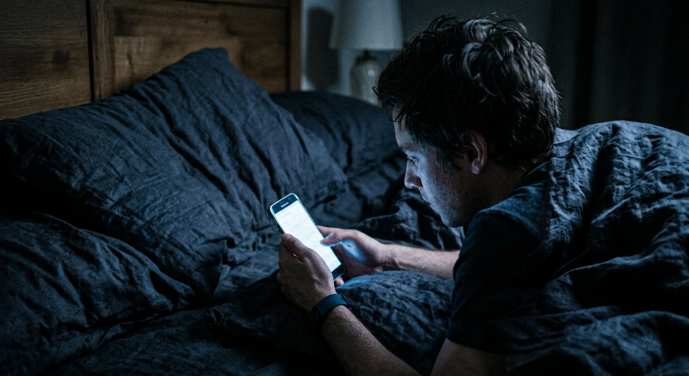
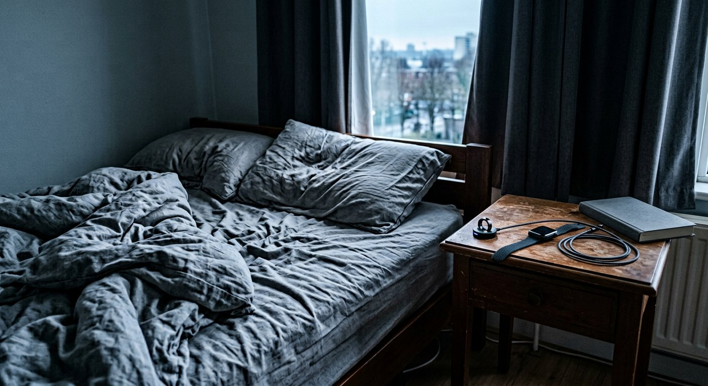

# You Are Not Sleeping Badly. You Are Being Told You Are.

### Trackers turned rest into a nightly performance review. Clinicians now have a name for what happens next.

**HEALTH | WELL**

*By Miriam Solberg*
*July 27, 2026*

*Sleep requires a drop in arousal. Checking whether you have achieved it raises arousal. The loop closes from there. (Photograph for this article)*

---

Every morning at 6:40, before coffee, before speaking to another human being, Jordan Pike is handed a number between 1 and 100.

It is called a Recovery Score. It is produced by the band on his wrist, which has spent the night measuring his heart rate variability, his respiration and how much he moved. On a good morning it reads in the 80s and Mr. Pike, 41, a physical therapist in Sacramento, feels equal to the day. On a bad morning it reads 34.

It is the 34s that eventually worried him — not because he felt terrible, but because of what happened next.

"On a 34 day I'm wrecked all day," he said. "Even when I slept fine. Especially when I slept fine and it says 34. Then I spend the whole day trying to work out what's wrong with me."

Mr. Pike no longer looks at the number before noon. By his own account, he is sleeping better.

There is a clinical term for what he was doing to himself. In 2017, researchers at Rush University Medical Center described patients presenting with insomnia complaints driven not by poor sleep but by anxiety about data suggesting poor sleep. They called it orthosomnia — an unhealthy preoccupation with achieving perfect sleep.

The trackers have improved a great deal in the nine years since. So has the problem.

## A vast market on top of a real problem

First, what is not in dispute. Sleep matters enormously. Most adults need roughly seven to nine hours, and a large share of Americans do not get it. Chronic short sleep is associated with cardiovascular disease, metabolic dysfunction, blunted immune response and worse mental health. Untreated obstructive sleep apnea is both genuinely dangerous and badly underdiagnosed.

Around that legitimate problem has grown a multibillion-dollar consumer category: rings, bands, scoring apps, temperature-regulating mattresses, weighted blankets, mouth tape, red-spectrum bulbs and a supplement aisle that did not exist in 2015.

Some of it works. A great deal of it has been evaluated chiefly by the companies selling it.

"Wearables are quite good at telling you whether you were asleep or awake," said Dr. Nadia Ferreira, a sleep physician at a Boston academic medical center. "They are mediocre at staging — how much deep sleep, how much REM. Validation studies against polysomnography put stage-level agreement somewhere in the 50-to-70-percent range. And staging is precisely what the app puts on the front screen, in a nice color, with a little trend arrow."

Her objection is not that the devices are worthless. It is that they display precision where precision does not exist.

"A number with two significant figures reads as a fact," she said. "What you're looking at is an estimate with a wide error bar, wearing a costume."

## Why the loop closes

The way sleep tracking backfires is not mysterious. It is the same machinery that drives ordinary insomnia.

Sleep requires arousal to fall. Monitoring performance makes arousal rise. So the person who gets into bed thinking *I need 90 minutes of deep sleep tonight* has, in the act of thinking it, made the outcome less likely — and will receive a report at 6:40 a.m. confirming the failure, which supplies the raw material for tomorrow night's worry.

"It's a closed loop, and the device is inside it," Dr. Ferreira said. "I have patients who sleep well and feel awful, and the only variable I can isolate is the app."

The first-line treatment for chronic insomnia is neither a supplement nor a gadget. It is cognitive behavioral therapy for insomnia, CBT-I, recommended ahead of medication by multiple professional bodies including the American College of Physicians, and typically delivered in four to eight sessions.

Several of its central instructions are the opposite of what a tracking app encourages: get out of bed when you cannot sleep, stop watching the clock, spend less time in bed rather than more, and give up on controlling the outcome.

Access is the bottleneck. Trained CBT-I clinicians are scarce and waitlists in much of the country run for months, which is a substantial part of why an $89 ring feels like the option that actually exists.

*The interventions with the strongest evidence behind them are unglamorous, repetitive and free — which is roughly the point. (Photograph for this article)*

## What the evidence actually supports

Strip away the marketing and the best-supported interventions are dull, free and require repetition:

**A fixed wake time, seven days a week.** The most powerful lever most people have, and the first one sacrificed on Saturday. Wake time anchors the circadian clock; bedtime follows it.

**Outdoor light in the morning.** Ten to thirty minutes soon after waking. Outdoor light on an overcast day is dramatically brighter than any indoor room, and the effect is on timing, not merely alertness.

**The bed for sleep and sex only.** Working, scrolling and worrying in bed train the brain to treat the bed as the place for working, scrolling and worrying.

**Caffeine stopped eight to ten hours before bed** — and alcohol understood for what it is: a sedative that reliably fragments the back half of the night and suppresses REM, which is why six hours after three drinks feels like four.

**A cool, dark room.** Core body temperature has to fall for sleep to begin. An overwarm bedroom is a common obstacle and among the easiest to fix.

Not one of these can be purchased, which is very close to the point.

## When to stop optimizing and see a doctor

Dr. Ferreira's list of things no app will solve: loud snoring with witnessed pauses in breathing; falling asleep involuntarily during the day; an irresistible urge to move the legs at night; trouble sleeping three or more nights a week for longer than three months.

Those are clinical presentations, and several of them have excellent treatments.

"If the device says something is wrong and you feel fine, investigate the device," she said. "If you feel wrong, I don't care what the device says. Come in."

Mr. Pike still wears his band. He looks at the weekly average now instead of the daily score, which is closer to how the underlying data ought to be read in any case. Mostly he has returned to the test he used before he owned one.

"I ask myself whether I'm tired," he said. "Turns out I can tell."

---

*Miriam Solberg writes about health and behavior for Well. This is an original feature draft and is not medical advice; individuals and quotations are illustrative and would require verification before publication. Photographs were generated for illustration.*
