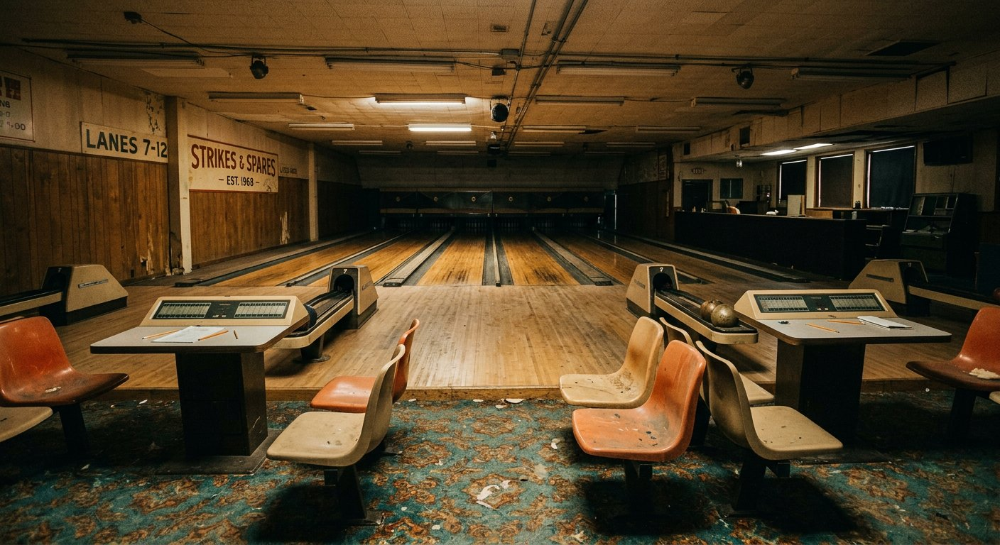
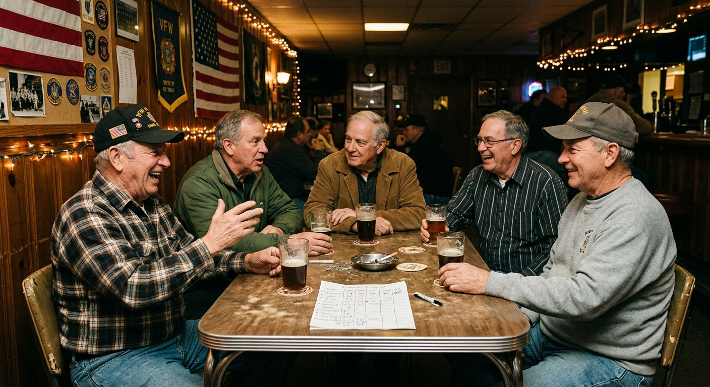

# Where Did Everybody Go?

### The quiet collapse of the places Americans used to run into each other

**CULTURE | AMERICAN LIFE**

*By Owen Braddock*
*July 27, 2026*

*The lanes on Watervliet Avenue in Dayton, Ohio, closed in March after 61 years. The league that used them had been meeting on Tuesdays since 1974. (Photograph for this article)*

---

DAYTON, Ohio — The bowling alley on Watervliet Avenue closed on a Sunday in March, after 61 years, and the following Tuesday the eight men of its oldest league sat in a Bob Evans parking lot, in their separate cars, trying to decide what to do.

They had been meeting on Tuesdays since 1974. Their average age was 63.

"We found a place out by the highway," said Ron Kessler, 66, a retired machinist and the league's unofficial secretary. "It's fine. It's got lanes. But you don't run into anybody there. You go, you bowl, you leave."

The distinction Mr. Kessler is drawing — between somewhere you go to do a thing and somewhere you run into people — is the one the sociologist Ray Oldenburg named in 1989 when he coined the phrase "third place." Not home, not work, but the third thing: the barbershop, the diner counter, the parish hall, the corner tavern, the bowling alley on Watervliet Avenue.

Those places have been thinning out for forty years. What has changed lately is the speed, and who is finally noticing.

## The numbers under the feeling

Between 1998 and 2024, the number of bowling centers in the United States fell by roughly half. Bars and taverns have shrunk as a share of food-and-drink establishments since the 1980s. In 2020, for the first time since Gallup began asking in 1937, membership in a house of worship fell below half of American adults. The Elks, the Moose and the Kiwanis have each lost most of a generation.

The American Time Use Survey, meanwhile, shows in-person socializing declining in nearly every age bracket, with the sharpest fall among adults in their 20s, who now log substantially less face-to-face time per day than the same cohort did in 2003.

The obvious culprit is in everyone's pocket, and researchers are wary of it.

"People hear these numbers and immediately reach for phones," said Camille Duquette, a sociologist at Rutgers who studies neighborhood institutions. "Phones matter. But I would point at duller things — the price of commercial real estate, the death of the informal economy that let a man run a bar as a break-even hobby, and the fact that we zoned most of this country so that you cannot walk to anything."

Her argument is that third places were rarely profitable in the way modern retail must be. They survived on cheap rent, cash registers, owners who lived upstairs and regulars who turned up four nights a week. Remove any leg and the stool goes over.

## The replacement that isn't

Something has moved into the vacancy: the third place with a turnstile.

Boutique fitness studios, run clubs, climbing gyms, board-game cafes, coworking lounges and nine-dollar pour-over counters have all been described — frequently by their own marketing departments — as community. Some genuinely are. Nearly all of them share one feature the old places did not. You have to keep paying.

"I love my gym. I have four real friends from my gym," said Aisha Nolan, 31, a project manager in Atlanta. "It's $189 a month. When I got laid off in 2023 I cancelled, and I lost the four friends in about six weeks. That's when I understood what I had actually been buying."

The economics select for a particular customer: disposable income, a free weeknight, usually no children. The people third places historically served best — retirees, shift workers, teenagers, anyone with time but not money — are the ones the subscription model serves worst.

Public libraries are the great exception, and librarians know it better than anyone. Visits for reasons unrelated to borrowing books — meetings, classes, warmth, air-conditioning, Wi-Fi, company — now account for a large and rising share of foot traffic.

"We are the last building in town where you can sit for four hours and nobody asks you to buy anything," said a branch manager in suburban Cleveland. "We were never staffed for that. We do it anyway."

*The league found a new home in June, in a V.F.W. hall with four lanes in the basement. Two members have started arriving early to eat dinner there. (Photograph for this article)*

## What is actually lost

The consequences surface in places that look unrelated.

Loneliness is the headline, and it is not imaginary: the U.S. Surgeon General's 2023 advisory tied chronic social disconnection to cardiovascular risk on a scale comparable to well-established behavioral risks. But scholars of civic life point to a second casualty, harder to feel and probably more consequential.

Third places manufactured weak ties — the acquaintances who are not your friends. Weak ties are how people have historically found jobs, apartments, contractors, babysitters and, in the classic finding, spouses. Less romantically, they are the mechanism by which a person encounters a neighbor who votes the other way and continues to regard that neighbor as a person.

"Strong ties give you support," Dr. Duquette said. "Weak ties give you a society. We have gotten quite good at protecting the first and terrible at the second."

## Small, unglamorous repairs

No policy reopens the bowling alley on Watervliet Avenue. But a few interventions keep recurring in the research and in interviews, and none of them are grand.

Zoning that permits a coffee shop on a residential corner. Municipal money for the buildings that already do this work — libraries, rec centers, senior centers — instead of another innovation district. Recurring, unstructured gatherings on a fixed schedule, where the regularity turns out to matter far more than the quality of the event. And, over and over, one person willing to send the text.

That last item is carrying enormous weight. Across four states, nearly every functioning informal group traced back to a single self-appointed organizer, usually unasked and often quietly resentful about it.

"It's me. I book the court," said Devon Marsh, 47, who has convened a Thursday pickup basketball game in Portland, Me., for nine years. "If I stopped, it would be over inside a month. I've tested that theory by getting the flu."

Mr. Kessler's league found a new home in June: a V.F.W. hall with four lanes in the basement and a bar that opens at four. Attendance is up. Two of the men now come early to eat dinner there.

It is not the same building, Mr. Kessler said, and he does not pretend otherwise.

"But somebody knew my name the second week," he said. "That's the whole thing. That's all it ever was."

---

*Owen Braddock writes about communities and civic life. This is an original feature draft; individuals and quotations are illustrative and would require verification before publication. Photographs were generated for illustration.*
